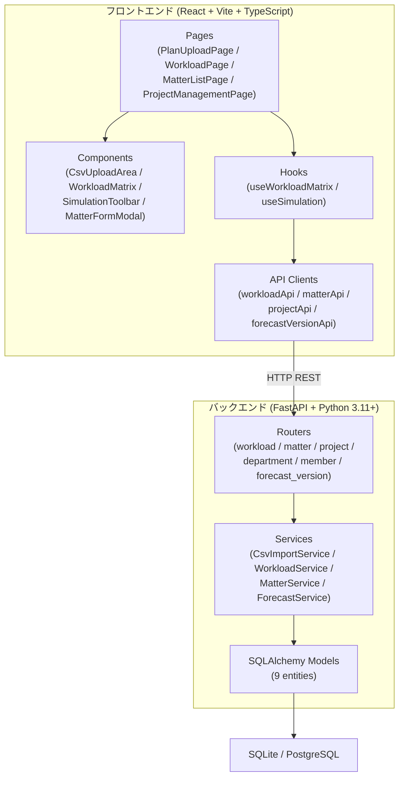
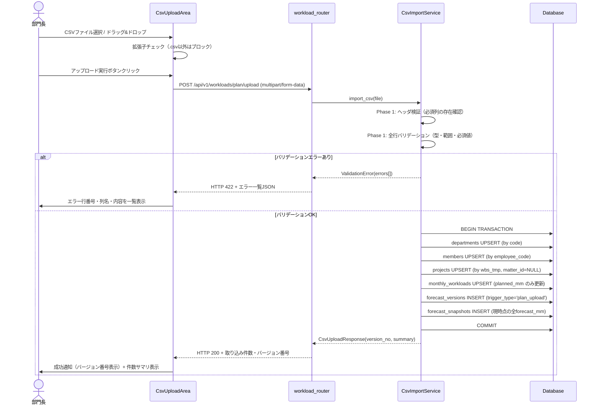
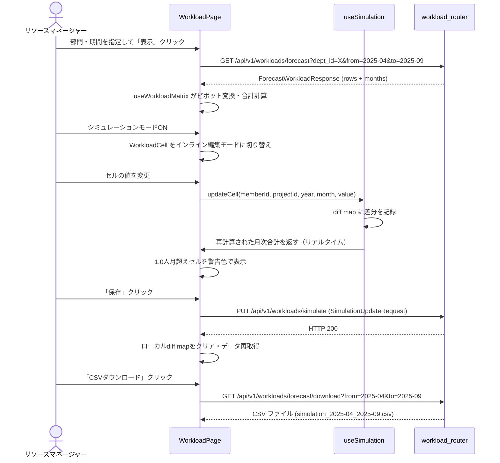

# 設計ドキュメント：計画工数CSVアップロードと見込工数確認・シミュレーション

---

## Overview

本機能はプロジェクト工数管理システムのMVPとして、部門長・リソースマネージャー・PMが工数の計画・見込を一元管理できる基盤を提供する。計画工数CSVのアップロードによりマスタデータと工数データを自動同期し、シミュレーション機能で最適な要員配置計画を立案できる。

**Purpose**: 外部システムが出力した計画工数CSVをシステムに取り込み、見込工数の確認とシミュレーションを実現する。

**Users**: 部門長（CSVアップロード）、リソースマネージャー（シミュレーション・CSVダウンロード）、PM（案件・プロジェクト管理・工数確認）。

**Impact**: 新規グリーンフィールド実装。既存コードベースへの変更なし。

### Goals

- 計画工数CSVを安全にインポートし、マスタデータと工数データを自動upsertする
- 見込工数（COALESCE(simulated_mm, planned_mm)）を月次・要員・プロジェクト単位で確認できる
- シミュレーションモードで工数値をインライン編集し、最適配置を検討できる
- CSVアップロードのたびに見込工数スナップショットを自動保存し、変化を追跡できる

### Non-Goals

- 実績工数の取り込み・表示（仕様別途検討）
- 計画vs実績の比較表示
- 今月見込みCSVとの比較
- 認証・権限管理
- チーム管理・要員のチーム紐づけ操作

---

## Boundary Commitments

### This Spec Owns

- `POST /api/v1/workloads/plan/upload` エンドポイントの仕様と挙動
- CSVバリデーションルール（ヘッダ検証・行検証）
- マスタデータ（departments / members / projects）の自動upsertロジック
- monthly_workloads の planned_mm upsert ロジック（simulated_mm・actual_mm は不変）
- forecast_versions + forecast_snapshots の自動作成
- 見込工数マトリクスの表示仕様（閲覧・シミュレーション）
- simulated_mm の保存・リセット API
- 案件CRUD・プロジェクト管理・案件紐づけ機能
- CSVダウンロード（見込工数・シミュレーション値）

### Out of Boundary

- 実績工数（actual_mm）の取り込みロジック（別途仕様策定）
- チーム管理・team_members テーブルへの書き込み
- 認証ミドルウェア・ユーザー管理
- 今月見込みCSVとの比較機能

### Allowed Dependencies

- Steering data-model.md で定義された全9エンティティのテーブルスキーマ
- Steering tech.md の技術スタック（FastAPI / SQLAlchemy 2.x / React / Ant Design 5.x）
- Alembic マイグレーション基盤（別タスクで初期化）

### Revalidation Triggers

- `projects.matter_id` の NULLABLE 変更（本設計での決定 — 後続スペックに影響）
- forecast_versions / forecast_snapshots のスキーマ変更
- `/api/v1/workloads/*` のAPIレスポンス形状変更

---

## Architecture

### Architecture Pattern & Boundary Map

単一モノリス構成（FastAPI バックエンド + React SPA フロントエンド）。レイヤードアーキテクチャを採用し、Router → Service → Model → DB の依存方向を一方向に保つ。



**主要な設計決定**:
- `matter_id` は **NULLABLE FK** に変更。CSV取り込みプロジェクトは案件未紐づけ（NULL）で登録し、後から手動で案件に紐づける（要件 4.5）
- 見込工数マトリクスのピボット変換は**フロントエンド（useWorkloadMatrix）**で実施。バックエンドはフラットリストを返す（詳細は research.md 参照）
- CSVインポートは**2フェーズ処理**（検証全件完了 → DBトランザクション）。エラー時は全件ロールバック（要件 3.7）
- 見込工数の導出式 `COALESCE(simulated_mm, planned_mm)` は**バックエンドの WorkloadService**で計算し、`forecast_mm` としてAPIレスポンスに含める

### Technology Stack

| Layer | Choice / Version | Role in Feature |
|-------|-----------------|-----------------|
| Frontend | React 18.x + Vite 5.x + TypeScript 5.x | SPA画面・状態管理・API通信 |
| UI Library | Ant Design 5.x | テーブル・フォーム・アップロードUI・通知 |
| API Client | Axios | バックエンドREST API通信 |
| Backend | FastAPI 0.110+ | REST APIエンドポイント |
| Language | Python 3.11+ | ビジネスロジック実装 |
| ORM | SQLAlchemy 2.x | DBアクセス・upsert |
| Validation | Pydantic v2 | リクエスト/レスポンス型検証 |
| DB (開発) | SQLite | ローカル開発 |
| DB (本番) | PostgreSQL | 本番環境 |
| Migrations | Alembic | スキーママイグレーション |
| CSV Parsing | Python `csv` 標準ライブラリ | CSVパース（外部依存なし） |

---

## File Structure Plan

### Directory Structure

```
backend/app/
├── main.py                        # FastAPIアプリ初期化・ルーター登録
├── database.py                    # SQLAlchemy Session・エンジン設定
├── routers/
│   ├── workload_router.py         # 工数API (upload / forecast / simulate / download)
│   ├── matter_router.py           # 案件CRUD
│   ├── project_router.py          # プロジェクト管理・案件紐づけ
│   ├── department_router.py       # 部門一覧
│   ├── member_router.py           # 要員一覧
│   └── forecast_version_router.py # 見込工数バージョン一覧
├── services/
│   ├── csv_import_service.py      # CSVパース・バリデーション・upsertオーケストレーション
│   ├── workload_service.py        # 見込工数取得・forecast_mm計算・simulate保存
│   ├── matter_service.py          # 案件ビジネスロジック
│   └── forecast_service.py        # forecast_versions/snapshots作成
├── models/                        # SQLAlchemyモデル（エンティティ1ファイル1モデル）
│   ├── department.py
│   ├── team.py
│   ├── team_member.py
│   ├── member.py
│   ├── matter.py
│   ├── project.py                 # matter_id: nullable FK（Steering定義から変更）
│   ├── monthly_workload.py
│   ├── forecast_version.py
│   └── forecast_snapshot.py
└── schemas/                       # Pydantic v2スキーマ
    ├── workload_schema.py          # CSV upload / forecast / simulate スキーマ
    ├── matter_schema.py
    ├── project_schema.py
    ├── member_schema.py
    ├── department_schema.py
    └── forecast_version_schema.py

frontend/src/
├── pages/
│   ├── PlanUploadPage.tsx          # 計画工数CSVアップロード画面
│   ├── WorkloadPage.tsx            # 見込工数確認・シミュレーション画面
│   ├── MatterListPage.tsx          # 案件一覧・登録画面
│   ├── ProjectManagementPage.tsx   # プロジェクト管理画面
│   └── ForecastVersionPage.tsx     # 見込工数バージョン一覧画面
├── components/
│   ├── layout/
│   │   └── AppLayout.tsx           # サイドバー + コンテンツエリア（Ant Design Layout）
│   ├── upload/
│   │   ├── CsvUploadArea.tsx       # ドラッグ&ドロップ + ファイル選択UI
│   │   └── UploadResultPanel.tsx   # 取り込み結果（件数・バージョン番号・エラー一覧）
│   ├── workload/
│   │   ├── WorkloadMatrix.tsx      # マトリクステーブル（要員行・月列・展開行）
│   │   ├── WorkloadCell.tsx        # セル（通常表示 / インライン編集の切り替え）
│   │   ├── WorkloadFilter.tsx      # 部門/チームフィルタ・年月範囲指定
│   │   └── SimulationToolbar.tsx   # シミュレーションモード切り替え・保存・リセット・DL
│   ├── matter/
│   │   ├── MatterTable.tsx
│   │   ├── MatterFormModal.tsx     # 案件新規登録フォーム（Modal）
│   │   └── ProjectAssignModal.tsx  # プロジェクトの案件紐づけ（Modal）
│   └── project/
│       ├── ProjectTable.tsx
│       └── ProjectEditModal.tsx    # プロジェクト編集（Modal）
├── api/
│   ├── workloadApi.ts              # 工数関連API呼び出し関数
│   ├── matterApi.ts
│   ├── projectApi.ts
│   ├── departmentApi.ts
│   └── forecastVersionApi.ts
├── types/
│   ├── workloadTypes.ts            # 工数・CSV・シミュレーション関連型定義
│   ├── matterTypes.ts
│   ├── projectTypes.ts
│   └── commonTypes.ts              # 共通型（ApiError, ImportCount等）
└── hooks/
    ├── useWorkloadMatrix.ts        # 見込工数データ取得・ピボット変換・合計計算
    └── useSimulation.ts            # シミュレーション変更差分管理・保存・リセット
```

---

## System Flows

### Flow 1: 計画工数CSVアップロード（要件 1〜6）



**フロー上の決定事項**:
- バリデーションは全行を検査してから一覧表示（途中でストップしない）
- DBトランザクションはupsert完了 + バージョン作成 + スナップショット記録まで1トランザクション

### Flow 2: 見込工数シミュレーション（要件 8・9）



---

## Requirements Traceability

| 要件 | 概要 | コンポーネント | インターフェース |
|------|------|--------------|----------------|
| 1.1〜1.6 | CSV画面アップロードUI | CsvUploadArea, UploadResultPanel | - |
| 2.1〜2.4 | CSVアップロードAPIエンドポイント | workload_router | POST /api/v1/workloads/plan/upload |
| 3.1〜3.7 | CSVフォーマットバリデーション | CsvImportService | ValidationError スキーマ |
| 4.1〜4.7 | マスタデータ自動upsert | CsvImportService | - |
| 5.1〜5.4 | 計画工数データupsert | CsvImportService | monthly_workloads |
| 6.1〜6.3 | 見込工数バージョン自動作成 | ForecastService, ForecastVersionPage | GET /api/v1/forecast-versions |
| 7.1〜7.5 | 案件・プロジェクト手動管理 | MatterListPage, ProjectManagementPage | GET/POST /api/v1/matters, PUT /api/v1/projects/* |
| 8.1〜8.7 | 見込工数確認（閲覧） | WorkloadMatrix, useWorkloadMatrix | GET /api/v1/workloads/forecast |
| 9.1〜9.9 | 見込工数シミュレーション | WorkloadCell, SimulationToolbar, useSimulation | PUT /api/v1/workloads/simulate, GET /api/v1/workloads/forecast/download |

---

## Components and Interfaces

### コンポーネント一覧

| コンポーネント | Domain/Layer | 役割 | 要件カバレッジ | 主要依存 |
|--------------|--------------|------|--------------|---------|
| CsvImportService | Backend / Service | CSVパース・バリデーション・upsert | 2〜5 | SQLAlchemy Session |
| WorkloadService | Backend / Service | 見込工数取得・forecast_mm計算 | 8, 9 | monthly_workloads |
| ForecastService | Backend / Service | バージョン・スナップショット作成 | 6 | forecast_versions/snapshots |
| workload_router | Backend / Router | 工数関連エンドポイント定義 | 1〜2, 8〜9 | CsvImportService, WorkloadService |
| matter_router | Backend / Router | 案件CRUD | 7 | MatterService |
| project_router | Backend / Router | プロジェクト管理 | 7 | - |
| CsvUploadArea | Frontend / UI | ファイルアップロードUI | 1 | Ant Design Upload |
| UploadResultPanel | Frontend / UI | 取り込み結果・エラー一覧表示 | 1 | - |
| WorkloadMatrix | Frontend / UI | 工数マトリクス表示（展開行） | 8 | useWorkloadMatrix, WorkloadCell |
| WorkloadCell | Frontend / UI | セル表示・インライン編集 | 8, 9 | useSimulation |
| SimulationToolbar | Frontend / UI | シミュレーション操作バー | 9 | useSimulation |
| useWorkloadMatrix | Frontend / Hook | データ取得・ピボット変換・合計計算 | 8 | workloadApi |
| useSimulation | Frontend / Hook | シミュレーション差分管理・保存・リセット | 9 | workloadApi |

---

### Backend / Service Layer

#### CsvImportService

| Field | Detail |
|-------|--------|
| Intent | CSVの2フェーズ処理（バリデーション→DB upsert）のオーケストレーション |
| Requirements | 2.1〜5.4 |

**Responsibilities & Constraints**
- Phase 1（バリデーション）：全行を走査し、エラーがあれば全エラーを `list[CsvValidationError]` に収集。エラー1件でも DB操作は一切しない
- CSVフォーマットはワイド形式（1行 = 1要員 × 1プロジェクト × 会計年度分12ヶ月）。詳細は `.kiro/steering/csv-spec.md` を参照
- Phase 2（DB upsert）：1つのSQLAlchemyトランザクション内で departments → members → projects → monthly_workloads の順で upsert。FKの依存順序を守る
- `simulated_mm` および `actual_mm` は一切変更しない（monthly_workloads の upsert 対象カラムは `planned_mm` のみ）
- 文字コードは Shift-JIS 固定で読み込む（UTF-8は不要）

**Contracts**: Service [✓]

##### Service Interface（Python）
```python
class CsvImportService:
    def import_plan_csv(
        self, file_content: bytes, db: Session
    ) -> CsvUploadResponse:
        """
        バリデーションエラー時は CsvValidationException を raise。
        正常時は CsvUploadResponse を返す。トランザクション管理はこのメソッド内。
        """
    
    def _validate_headers(self, headers: list[str]) -> list[CsvValidationError]: ...
    
    def _validate_rows(
        self, rows: list[dict[str, str]]
    ) -> list[CsvValidationError]: ...
```

**Preconditions**: `file_content` は `.csv` ファイルのバイト列  
**Postconditions**: エラーなし時、DB が新しい状態に更新され `forecast_versions` + `forecast_snapshots` が作成されている  
**Invariants**: `simulated_mm` と `actual_mm` は処理前後で不変

**Implementation Notes**
- CSVパースは Python `csv.DictReader` を使用（`encoding='shift_jis'`）
- 会計年度 FY の4月〜12月は `year=FY`、1月〜3月は `year=FY+1` に変換して month とセットで保存
- 月次工数 0.00 の月はDBレコードが存在しない場合は INSERT をスキップ、存在する場合は 0.00 に UPDATE
- upsert は SQLAlchemy 2.x の `insert().on_conflict_do_update()` で実装（SQLite: `REPLACE INTO`、PostgreSQL: `ON CONFLICT DO UPDATE`）
- バージョン作成と スナップショット記録は `ForecastService.create_version_with_snapshot()` に委譲

---

#### WorkloadService

| Field | Detail |
|-------|--------|
| Intent | 見込工数データの取得・forecast_mm計算・シミュレーション保存 |
| Requirements | 8.1〜9.9 |

**Responsibilities & Constraints**
- `get_forecast()` : departments / teams / 期間でフィルタした monthly_workloads を取得し、`forecast_mm = simulated_mm if simulated_mm is not None else planned_mm` を計算して返す
- `save_simulation()` : 差分リストを受け取り、`simulated_mm` を一括更新
- `reset_simulation()` : 指定条件の `simulated_mm` を NULL に更新

**Contracts**: Service [✓]

##### Service Interface（Python）
```python
class WorkloadService:
    def get_forecast(
        self,
        db: Session,
        dept_id: int | None,
        team_id: int | None,
        year_from: int,
        month_from: int,
        year_to: int,
        month_to: int,
    ) -> ForecastWorkloadResponse: ...

    def save_simulation(
        self, db: Session, updates: list[SimulationUpdateItem]
    ) -> None: ...

    def reset_simulation(
        self, db: Session, member_id: int | None, project_id: int | None
    ) -> None: ...
    
    def download_forecast_csv(
        self,
        db: Session,
        year_from: int,
        month_from: int,
        year_to: int,
        month_to: int,
    ) -> str:  # CSV文字列
        ...
```

---

#### ForecastService

| Field | Detail |
|-------|--------|
| Intent | forecast_versions レコード作成と forecast_snapshots への一括スナップショット記録 |
| Requirements | 6.1〜6.2 |

**Responsibilities & Constraints**
- `create_version_with_snapshot()` : 新バージョンを INSERT し、現在の全 `monthly_workloads` から `COALESCE(simulated_mm, planned_mm)` を計算して `forecast_snapshots` に一括 INSERT
- バージョン番号は `MAX(version_no) + 1` で自動採番

##### Service Interface（Python）
```python
class ForecastService:
    def create_version_with_snapshot(
        self, db: Session, trigger_type: str
    ) -> int:  # 作成されたversion_noを返す
        ...
```

---

### Backend / Router Layer

#### workload_router（API Contract）

**Contracts**: API [✓]

| Method | Endpoint | Request | Response | Errors |
|--------|----------|---------|----------|--------|
| POST | `/api/v1/workloads/plan/upload` | `multipart/form-data` (file) | `CsvUploadResponse` (200) | 422 (バリデーションエラー), 500 |
| GET | `/api/v1/workloads/forecast` | Query: `dept_id?`, `team_id?`, `from` (YYYY-MM), `to` (YYYY-MM) | `ForecastWorkloadResponse` (200) | 400, 500 |
| PUT | `/api/v1/workloads/simulate` | `SimulationUpdateRequest` (JSON) | `{"ok": true}` (200) | 400, 500 |
| DELETE | `/api/v1/workloads/simulate` | Query: `member_id?`, `project_id?` | `{"ok": true}` (200) | 400, 500 |
| GET | `/api/v1/workloads/forecast/download` | Query: `from` (YYYY-MM), `to` (YYYY-MM) | `text/csv` (200) | 400, 500 |

**Pydantic Schemas（抜粋）**:

```python
# schemas/workload_schema.py

class ImportCount(BaseModel):
    created: int
    updated: int

class ImportSummary(BaseModel):
    departments: ImportCount
    members: ImportCount
    projects: ImportCount
    workloads: ImportCount

class CsvUploadResponse(BaseModel):
    version_no: int
    summary: ImportSummary

class CsvValidationError(BaseModel):
    row_no: int
    column: str
    message: str

class CsvUploadErrorResponse(BaseModel):
    errors: list[CsvValidationError]

class ForecastCell(BaseModel):
    planned_mm: Decimal | None = None
    simulated_mm: Decimal | None = None
    forecast_mm: Decimal          # COALESCE(simulated_mm, planned_mm)

class ForecastProjectRow(BaseModel):
    project_id: int
    project_name: str
    wbs_tmp: str
    matter_id: int | None = None
    matter_name: str | None = None
    cells: dict[str, ForecastCell]  # キー: "YYYY-MM"

class ForecastMemberRow(BaseModel):
    member_id: int
    member_name: str
    employee_code: str
    monthly_sums: dict[str, Decimal]   # キー: "YYYY-MM", 値: forecast_mm合計
    projects: list[ForecastProjectRow]

class ForecastWorkloadResponse(BaseModel):
    months: list[str]                  # ["2025-04", "2025-05", ...]
    rows: list[ForecastMemberRow]

class SimulationUpdateItem(BaseModel):
    member_id: int
    project_id: int
    year: int
    month: int
    simulated_mm: Decimal | None       # None → NULL にリセット

class SimulationUpdateRequest(BaseModel):
    updates: list[SimulationUpdateItem]
```

#### matter_router / project_router（API Contract）

| Method | Endpoint | Request | Response | Errors |
|--------|----------|---------|----------|--------|
| GET | `/api/v1/matters` | - | `list[MatterResponse]` (200) | 500 |
| POST | `/api/v1/matters` | `MatterCreateRequest` | `MatterResponse` (201) | 409 (code重複), 422 |
| PUT | `/api/v1/projects/{id}` | `ProjectUpdateRequest` | `ProjectResponse` (200) | 404, 422 |
| PUT | `/api/v1/projects/{id}/matter` | `{"matter_id": int}` | `ProjectResponse` (200) | 404, 409 |
| GET | `/api/v1/projects` | Query: `unassigned?` (bool) | `list[ProjectResponse]` (200) | 500 |
| GET | `/api/v1/forecast-versions` | - | `list[ForecastVersionResponse]` (200) | 500 |
| GET | `/api/v1/departments` | - | `list[DepartmentResponse]` (200) | 500 |
| GET | `/api/v1/members` | Query: `dept_id?` | `list[MemberResponse]` (200) | 500 |

---

### Frontend / Hook Layer

#### useWorkloadMatrix

| Field | Detail |
|-------|--------|
| Intent | 見込工数データの取得・ピボット変換・月次合計計算のカプセル化 |
| Requirements | 8.1〜8.7 |

**Contracts**: State [✓]

##### State Management（TypeScript）

```typescript
// types/workloadTypes.ts

interface ForecastCell {
  plannedMm: number | null;
  simulatedMm: number | null;
  forecastMm: number;
}

interface ForecastProjectRow {
  projectId: number;
  projectName: string;
  wbsTmp: string;
  matterId: number | null;
  matterName: string | null;
  cells: Record<string, ForecastCell>;  // "YYYY-MM" → ForecastCell
}

interface ForecastMemberRow {
  memberId: number;
  memberName: string;
  employeeCode: string;
  monthlySums: Record<string, number>;  // "YYYY-MM" → sum
  isOverload: Record<string, boolean>;  // "YYYY-MM" → sum > 1.0
  projects: ForecastProjectRow[];
}

interface WorkloadMatrixState {
  months: string[];
  rows: ForecastMemberRow[];
  loading: boolean;
  error: string | null;
}

// useWorkloadMatrix フック
interface UseWorkloadMatrixReturn {
  state: WorkloadMatrixState;
  fetchForecast: (params: ForecastQueryParams) => Promise<void>;
  recomputeWithSimDiff: (diff: SimulationDiff) => void;
}
```

- `recomputeWithSimDiff()`: APIを再叩きせず、ローカルdiff mapを反映してリアルタイム合計を再計算する

#### useSimulation

| Field | Detail |
|-------|--------|
| Intent | シミュレーション変更差分のローカル管理・一括保存・リセットAPI呼び出し |
| Requirements | 9.1〜9.9 |

**Contracts**: State [✓]

```typescript
// SimulationDiff: "memberId-projectId-YYYY-MM" → 変更後の値（null=リセット）
type SimulationDiff = Map<string, number | null>;

interface UseSimulationReturn {
  isSimulationMode: boolean;
  diff: SimulationDiff;
  toggleSimulationMode: () => void;
  updateCell: (
    memberId: number, projectId: number,
    year: number, month: number,
    value: number | null
  ) => void;
  saveSimulation: () => Promise<void>;
  resetSimulation: (memberId?: number) => Promise<void>;
  hasUnsavedChanges: boolean;
}
```

**Implementation Notes**
- diff は `Map<string, number | null>` で保持。保存時に `SimulationUpdateRequest` へ変換して PUT
- シミュレーションモード OFF 時は diff をクリアし、`fetchForecast()` を再実行
- リセット時は `DELETE /api/v1/workloads/simulate?member_id=X` を呼び出し、データ再取得

---

### Frontend / UI Layer

#### WorkloadMatrix

| Field | Detail |
|-------|--------|
| Intent | 要員を行・月を列とする工数マトリクスの表示。要員行の展開でプロジェクト内訳を表示 |
| Requirements | 8.3〜8.7, 9.2〜9.5 |

**実装の要点**:
- Ant Design `<Table>` の `expandable` プロパティで要員行 → プロジェクト行を展開
- 合計行は `summary` プロパティで最下行に固定表示
- `isOverload` が `true` のセルは `background: '#fff7e6'`（Ant Design の `orange-1`）で警告表示
- シミュレーションモード時は `WorkloadCell` が `<InputNumber>` に切り替わる

#### CsvUploadArea

| Field | Detail |
|-------|--------|
| Intent | CSVファイルのドラッグ&ドロップ・ファイル選択UIの提供 |
| Requirements | 1.1〜1.6 |

**実装の要点**:
- Ant Design `<Upload.Dragger>` を使用。`beforeUpload` でフロント側の拡張子チェック（`.csv` 以外は拒否）
- `customRequest` で Axios により `POST /api/v1/workloads/plan/upload` を呼び出す
- アップロード中は `<Spin>` を表示し、再操作不可にする
- 成功: `UploadResultPanel` に結果を渡して表示。`notification.success` でバージョン番号を通知
- 失敗: `UploadResultPanel` にエラー一覧を渡して表示

---

## Data Models

### Logical Data Model（本設計での変更点）

Steering data-model.md からの変更：

| エンティティ | カラム | Steering定義 | 本設計での変更 | 理由 |
|------------|--------|------------|--------------|------|
| projects | matter_id | `INTEGER FK NOT NULL` | `INTEGER FK NULL` | CSV取り込みプロジェクトは案件未紐づけで登録するため（要件 4.5） |

### Physical Data Model（変更カラムのみ）

```sql
-- projects テーブルの matter_id カラム（Alembicマイグレーションで定義）
matter_id INTEGER REFERENCES matters(id) ON DELETE SET NULL  -- NULLABLEに変更
```

### 見込工数の導出ロジック（MVPフェーズ）

```
forecast_mm = simulated_mm IS NOT NULL ? simulated_mm : planned_mm
```

> 実績工数（actual_mm）はMVPスコープ外。実績取り込み仕様が確定した際は、WorkloadService.get_forecast() のみを修正する（フロントエンド・API契約に変更なし）。

### スナップショット作成クエリ（論理）

```sql
INSERT INTO forecast_snapshots (version_id, member_id, project_id, year, month, forecast_mm)
SELECT
  :version_id,
  member_id, project_id, year, month,
  COALESCE(simulated_mm, planned_mm) AS forecast_mm
FROM monthly_workloads
WHERE COALESCE(simulated_mm, planned_mm) IS NOT NULL;
```

---

## Error Handling

### Error Strategy

- **CSVバリデーションエラー**（HTTP 422）: `CsvUploadErrorResponse {errors: CsvValidationError[]}` を返す。フロントエンドは `UploadResultPanel` でエラー一覧テーブル（行番号・列名・メッセージ）を表示
- **ビジネスルールエラー**（HTTP 409）: 案件コード重複など。フロントエンドは `notification.error` で表示
- **サーバーエラー**（HTTP 500）: `notification.error("サーバーエラーが発生しました。管理者に連絡してください。")`

### Error Categories and Responses

| カテゴリ | 例 | HTTP Status | フロントエンド挙動 |
|---------|-----|------------|-----------------|
| CSVバリデーション | 必須列欠如・型エラー | 422 | UploadResultPanel にエラー一覧表示 |
| ビジネスルール違反 | 案件コード重複 | 409 | notification.error |
| リソース未存在 | プロジェクトID不存在 | 404 | notification.error |
| サーバーエラー | DB接続失敗 | 500 | notification.error |

### Monitoring

- FastAPI のデフォルトログ（uvicorn）にエラースタックトレースを記録
- CSVインポートの場合は「バリデーションエラー件数・処理行数」をINFOログに記録

---

## Testing Strategy

### Unit Tests（バックエンド）

- `CsvImportService._validate_headers()`: 必須列の存在チェック・欠如時のエラーメッセージ
- `CsvImportService._validate_rows()`: 年/月/工数の型・範囲・必須値のバリデーション
- `WorkloadService.get_forecast()`: forecast_mm の計算ロジック（simulated_mm優先・NULLフォールバック）
- `ForecastService.create_version_with_snapshot()`: バージョン番号の自動採番ロジック

### Integration Tests（バックエンド）

- `POST /api/v1/workloads/plan/upload` 正常系: 新規登録・upsert後のDB状態確認
- `POST /api/v1/workloads/plan/upload` 異常系: バリデーションエラー時の全件ロールバック確認
- `PUT /api/v1/workloads/simulate`: simulated_mm の更新後に planned_mm が不変であることを確認
- バージョン作成 + スナップショット: アップロード後に forecast_versions と forecast_snapshots が正しく作成されていることを確認

### E2E / UI Tests

- CSVアップロード → 成功通知 → 件数サマリ表示のフロー
- バリデーションエラーCSVアップロード → エラー一覧表示のフロー
- 見込工数マトリクス表示 → 要員行展開 → プロジェクト内訳確認
- シミュレーションモードON → セル編集 → 1.0人月超え警告確認 → 保存 → モードOFF

### フロントエンド Unit Tests

- `useWorkloadMatrix`: API レスポンスからピボット変換と月次合計が正しく計算されること
- `useSimulation`: diff map の更新・保存リクエスト変換・リセット後のクリアが正しく動作すること
- `WorkloadCell`: シミュレーションモードのON/OFFでインライン編集の表示/非表示が切り替わること
